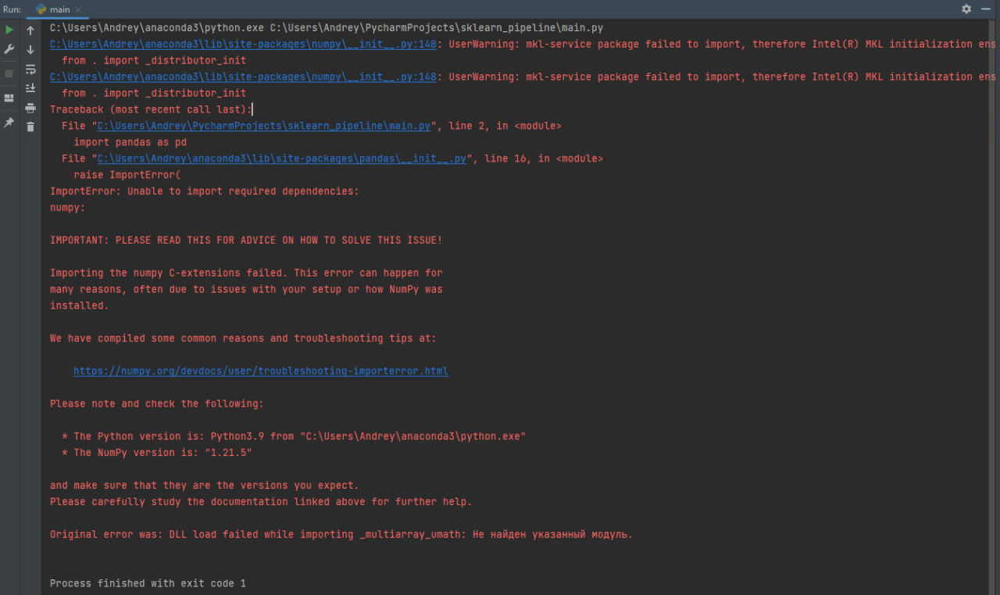

# Если не работает команда 'python3' или 'python' или 'py'

## Или 'pip'

Начинающие разработчики часто встречаются с ошибкой говорящей о том, что команд 'python' или 'pip' не существует. Ниже расскажу о причинах возникновения этой ошибки и как её исправить.

