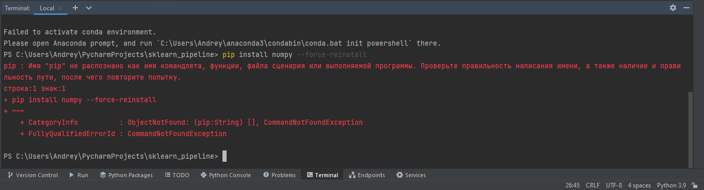

# Если не работают команды 'python3', 'python', 'py', 'pip', 'pip3'



Начинающие разработчики часто встречаются с ошибкой говорящей о том, что команд 'python' или 'pip' не существует. Ниже расскажу о причинах возникновения этой ошибки и как её исправить.

## Содержание:

1. [Почему возникает эта ошибка?](https://github.com/kianurivzzz/commandpythonnotfound#%D0%BF%D0%BE%D1%87%D0%B5%D0%BC%D1%83-%D0%B2%D0%BE%D0%B7%D0%BD%D0%B8%D0%BA%D0%B0%D0%B5%D1%82-%D1%8D%D1%82%D0%B0-%D0%BE%D1%88%D0%B8%D0%B1%D0%BA%D0%B0);
2. [Как исправить эту ошибку?](https://github.com/kianurivzzz/commandpythonnotfound#%D0%BA%D0%B0%D0%BA-%D0%B8%D1%81%D0%BF%D1%80%D0%B0%D0%B2%D0%B8%D1%82%D1%8C-%D1%8D%D1%82%D1%83-%D0%BE%D1%88%D0%B8%D0%B1%D0%BA%D1%83):
    * [Python не установлен (Windows/MacOS/Linux)](https://github.com/kianurivzzz/commandpythonnotfound#python-%D0%BD%D0%B5-%D1%83%D1%81%D1%82%D0%B0%D0%BD%D0%BE%D0%B2%D0%BB%D0%B5%D0%BD-windowsmacoslinux);
    * [Если Python точно установлен](https://github.com/kianurivzzz/commandpythonnotfound#%D0%B5%D1%81%D0%BB%D0%B8-python-%D1%82%D0%BE%D1%87%D0%BD%D0%BE-%D1%83%D1%81%D1%82%D0%B0%D0%BD%D0%BE%D0%B2%D0%BB%D0%B5%D0%BD);
    * [Правильная переустановка](https://github.com/kianurivzzz/commandpythonnotfound#%D0%BF%D1%80%D0%B0%D0%B2%D0%B8%D0%BB%D1%8C%D0%BD%D0%B0%D1%8F-%D0%BF%D0%B5%D1%80%D0%B5%D1%83%D1%81%D1%82%D0%B0%D0%BD%D0%BE%D0%B2%D0%BA%D0%B0).
3. [Заключение](https://github.com/kianurivzzz/commandpythonnotfound#%D0%B7%D0%B0%D0%BA%D0%BB%D1%8E%D1%87%D0%B5%D0%BD%D0%B8%D0%B5);
4. [Полезные ссылки](https://github.com/kianurivzzz/commandpythonnotfound#%D0%BF%D0%BE%D0%BB%D0%B5%D0%B7%D0%BD%D1%8B%D0%B5-%D1%81%D1%81%D1%8B%D0%BB%D0%BA%D0%B8).

## Почему возникает эта ошибка?

Причины возникновения две:

1. Python не установлен или работает некорректно;
2. Python при установке не был добавлен в PATH.

Если первая причина понятна, то вот вторая не совсем.

На вашем компьютере есть [переменные окружения](https://ru.wikipedia.org/wiki/%D0%9F%D0%B5%D1%80%D0%B5%D0%BC%D0%B5%D0%BD%D0%BD%D0%B0%D1%8F_%D1%81%D1%80%D0%B5%D0%B4%D1%8B). В них хранится разная служебная информация – например, данные о настройках. Одна из таких переменных окружения хранит в себе пути до исполняемых файлов. Нужна она для обращения к этим исполняемым файлам в терминале и дальнейшего запуска их функций. Называется такая переменная **PATH**.


Чаще всего все исполняемые файлы автоматически сохраняются в эту переменную. Но если этого не произошло, то оболочка терминала будет не в курсе о существовании этого инструмента.

В случае с Python это происходит по причине неправильной установки.

## Как исправить эту ошибку?

Ниже приведу примеры исправления разных ситуаций. Обращаю внимание, что в дальйнешем **все команды будут указаны без символа разделителя $**, так как в терминале он стоит в каждой строке.

### Python не установлен (Windows/MacOS/Linux)

Решение этой проблемы – установить Python.


**Windows/MacOS no brew/Linux:**


1. Перейдите на [официальный сайт](https://www.python.org/);
2. Наведите мышкой на вкладку Downloads;
3. Скачайте последнюю версию или выберите другую, но актуальную;
4. Запустите установочный файл;
5. В нижней части установщика поставьте галочку в чекбоксе "Add Python to PATH" и нажмите далее;
6. Дождитесь установки и проверьте работу команд.

**MacOS brew/Linux on terminal:**


1. В терминале напишите следующую команду:
```
# для brew в MacOS
brew install python

# для Debian-подобных Linux систем
sudo apt-get install python
```
2. Нажмите enter;
3. Проверьте работу команд Python.

### Если Python точно установлен

Тогда он установлен неправильно и его компоненты не были добавлены в PATH. У этой проблемы два способа решения:

1. Переустановить, но правильно;
2. Добавить исполняемые файлы в ручную через терминал.

Рассмотрим оба способа.

### Правильная переустановка

**Windows:**


1. Полностью удалите Python со своего компьютера в настройках или через деинсталятор;
2. Перейдите на [официальный сайт](https://www.python.org/) или используйте уже скачанный установщик и переходите к 5-му пункту;
3. Наведите мышкой на вкладку Downloads;
4. Скачайте последнюю версию или выберите другую, но актуальную;
5. Запустите установочный файл;
6. В нижней части установщика поставьте галочку в чекбоксе "Add Python to PATH" и нажмите далее;
7. Дождитесь установки и проверьте работу команд.

**MacOS/Linux:**

В случае с этими операционными системами процесс самой установки отличается и таких чекбоксов там нет. Поэтому, можно просто попробовать переустановить по способу выше. Но если это не помогло, то значит нужно добавить исполняемые файлы в ручную через терминал.

1. В терминале введите следующую команду:
```
# Примечание: /usr/local/bin/python – это путь до интерпретатора Python

# Для командной оболочки bash
export PATH="$PATH:/usr/local/bin/python

# Для командной оболочки csh
setenv PATH "$PATH:/usr/local/bin/python"

# Для командых оболочек sh и ksh
PATH="$PATH:/usr/local/bin/python"
```
2. Нажмите enter;
3. Проверьте работоспобность команд Python.


**Поздравляю, вы великолепны.**

## Заключение.

В ходе данного гайда стало известно, что причина ошибки "имя 'python' не распознано как имя командлета..." либо отсутствие Python, либо его неправильная установка. Способов решения этих проблем было несколько: установка, переустановка или танцы с бубном в терминале.

На этом всё. Если есть вопросы, предложения, исправления, то сразу об этом напишите. На вопросы будет отвечено, предложения рассмотрены, а исправления исправлены.

[Вернуться к содержанию](https://github.com/kianurivzzz/commandpythonnotfound#%D1%81%D0%BE%D0%B4%D0%B5%D1%80%D0%B6%D0%B0%D0%BD%D0%B8%D0%B5)

## Полезные ссылки

* [PATH это](https://ru.wikipedia.org/wiki/%D0%9F%D0%B5%D1%80%D0%B5%D0%BC%D0%B5%D0%BD%D0%BD%D0%B0%D1%8F_%D1%81%D1%80%D0%B5%D0%B4%D1%8B)
* [Официальный сайт Python](https://www.python.org/)
* [Если нет brew](https://brew.sh/index_ru)
* [Подробнее про установку Python](https://proglang.su/python/environment)
